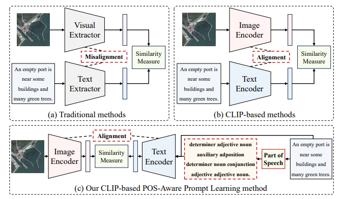
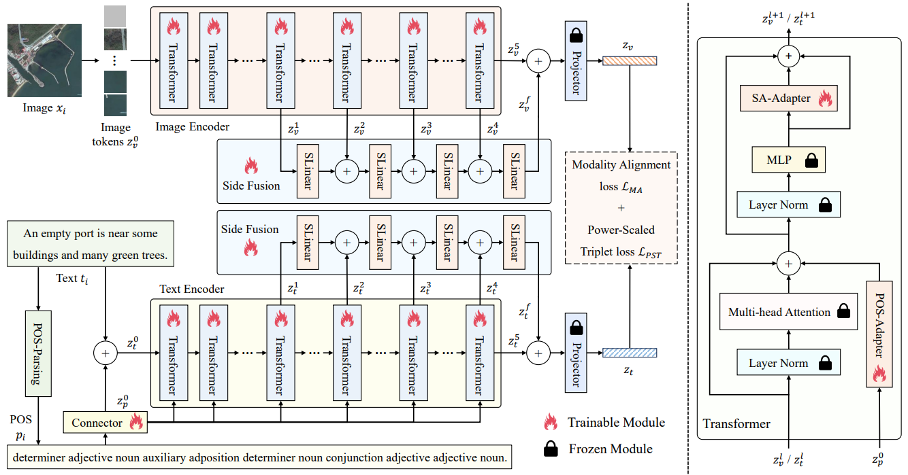
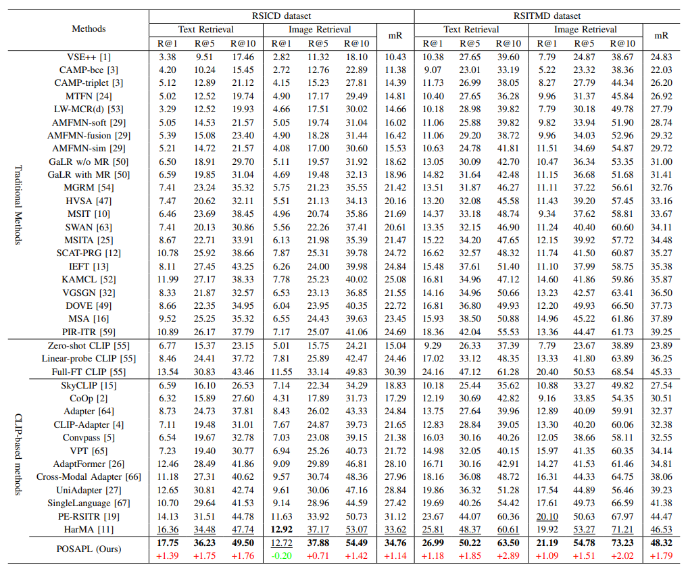
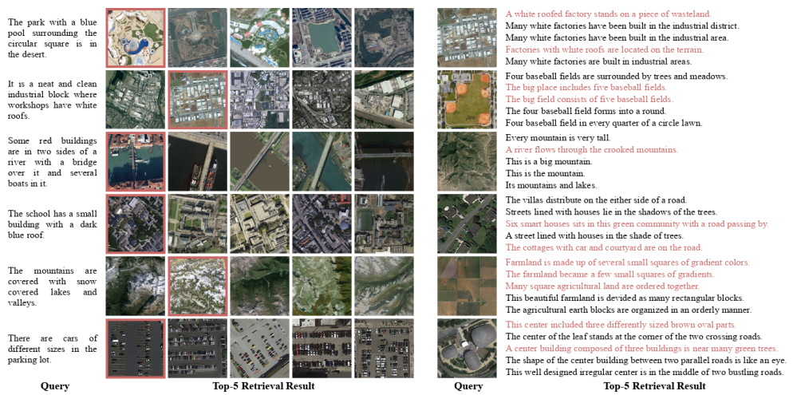

# The Code of "Part-of-Speech-Aware Prompt Learning for Remote Sensing Image-Text Retrieval"


## Abstract

The key to remote sensing image-text retrieval (RSITR) lies in effectively aligning features of image and text modalities. However, due to the complexity of text semantics and the diversity of visual content, existing methods still face challenges in dealing with complex semantics and modality alignment of long sentences. The part-of-speech (POS) of each word in a language is a basic grammatical property that can help the model understand the function and role of a word in context, thereby focusing on the key information in the text. Therefore, explicitly introducing POS as a prior in RSITR can optimize cross-modal alignment and improve retrieval performance. To this end, we propose a novel POS-aware RSITR method, called part-of-speech-aware prompt learning (POSAPL). This method introduces explicit POS priors to the Text Encoder through adapters, uses the Side Fusion module to fuse multi-level features to improve the cross-modal feature alignment capability, and adaptively enforces key similarities in feature alignment through an improved power-scaled triplet loss. Experimental results show that our method significantly improves the retrieval performance on the RSICD and RSITMD datasets, providing a novel and efficient solution for RSITR.


## Method






## Download

* Download [open_clip/models--laion--CLIP-ViT-B-32-laion2B-s34B-b79K/open_clip_pytorch_model.bin](https://huggingface.co/laion/CLIP-ViT-B-32-laion2B-s34B-b79K)

* Download [RSITMD](https://github.com/xiaoyuan1996/AMFMN/tree/master/RSITMD) and [RSICD](https://github.com/201528014227051/RSICD_optimal) from [Baidu Disk](https://pan.baidu.com/s/1mLkQA8InOxKjseGgEVoaew?pwd=c3c5) or [Google Drive](https://drive.google.com/file/d/140kYB3AEFv4Lp6pV1V0nQik115GaMl7i/view?usp=sharing)

## Train

* Get POS
```
python posapl_0_pos.py
```

* Train
```
python posapl_main.py
```

* The result in Paper (2024-12-01):
```
2024-12-01 20:37:57 {'txt_r1': 26.99, 'txt_r5': 50.22, 'txt_r10': 63.5, 'img_r1': 21.19, 'img_r5': 54.78, 'img_r10': 73.23, 'r_mean': 48.32}
2024-12-01 20:37:57 {'txt_r1': 17.75, 'txt_r5': 36.23, 'txt_r10': 49.5, 'img_r1': 12.72, 'img_r5': 37.88, 'img_r10': 54.49, 'r_mean': 34.76}
```

* The result in `train_2025_03_03.log`:
```
2025-03-03 09:27:28 {'txt_r1': 28.54, 'txt_r5': 50.22, 'txt_r10': 63.05, 'img_r1': 22.65, 'img_r5': 55.31, 'img_r10': 72.52, 'r_mean': 48.72}
2025-03-03 09:27:28 {'txt_r1': 16.56, 'txt_r5': 35.04, 'txt_r10': 50.69, 'img_r1': 13.34, 'img_r5': 37.22, 'img_r10': 53.74, 'r_mean': 34.43}
```

## Result






## Reference

* This code builds upon the excellent work of [https://github.com/seekerhuang/HarMA](https://github.com/seekerhuang/HarMA). 

